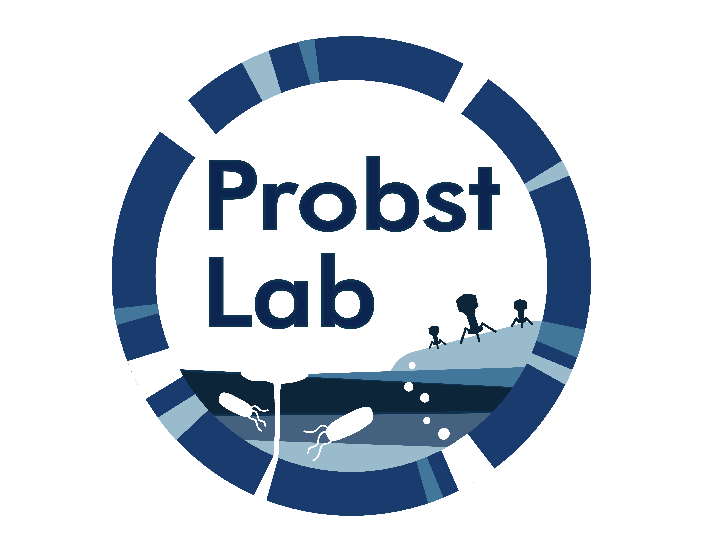

# Probst Lab Homepage

## General data

Environmental Metagenomics, Research Center One Health Ruhr of the University Alliance Ruhr, Faculty of Chemistry, University of Duisburg-Essen, Germany

Germany, 45141 Essen, Universitaetsstrasse 5

## Team members

Access an overview of current team members as well as contact information via:

[Team members](https://ProbstLab.github.io/Lab_homepage/teammembers )

## Publications

The publication list can be accessed via:

[Publication list](https:////ProbstLab.github.io/Lab_homepage/publications )
