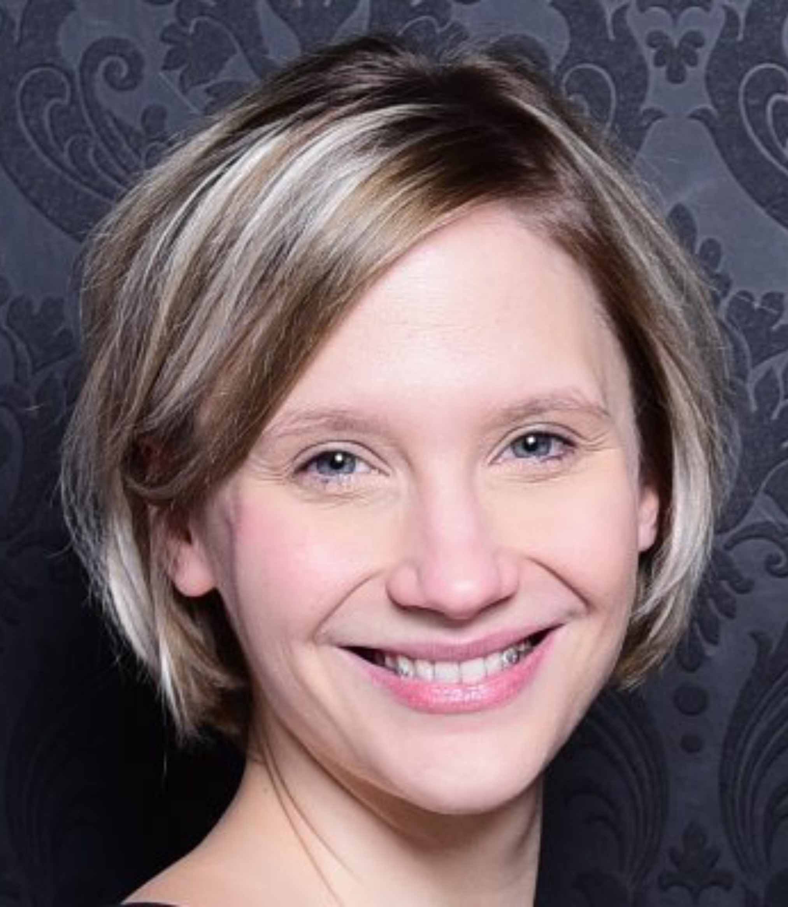

# Probst Lab Team members

This is a list of current (state March 1st 2023) Probst Lab team members with their current position, pictures and contact information (in no particular order).

Latest group picture from Spring 2023.

## Head of the lab

Prof. Dr. Alexander Joseph Probst

alexander.probst@uni-due.de, office: S05 T02 A30, office tel.: +49 201 1837080

## Staff Scientists

Dr. Liliana Cristina Moraru

liliana.cristina.moraru@uni-oldenburg.de

Dr. Andre Rodriguez-Soarez

andre.rodrigues-soares@uni-due.de, office: S05 T02 A27, office tel.: +49 201 1837085

## Team Assistant

Maximiliane Ackers

maximiliane.ackers@uni-due.de, office: S05 T02 B36, office tel.: +49 201 1836627

## Technical Assistants

Sabrina Eisfeld

sabrina.eisfeld@uni-due.de, office: S05 T02 A24, office tel.: +49 201 1833262

Ines Pothmann

ines.pothmann@uni-due.de, office: S05 T02 A24, office tel.: +49 201 1834109

## Computer Scientist

Ken Dreger

ken.dreger@uni-due.de

Manan Shah

manan.shah@uni-due.de, office: S05 V05 F28, office tel.: +49 201 1832441

## PostDocs

Dr. Julia Nuy

julia.nuy@uni-due.de, office: T03 R02 D60, office tel.: +49 201 1836935

Dr. Till Leander Valentin Bornemann

till.bornemann@uni-due.de, office: S05 T02 B16, office tel.: +49 201 1837180

## PhD Students

Julia Plewka

julia.plewka@uni-due.de, office: S05 T02 B16, office tel.: +49 201 1837180

Indra Banas

indra.banas@uni-due.de, office: S05 T02 A24, office tel.: +49 201 1834109

Sophie Simon

sophie.simon@uni-due.de, office: S05 T02 A27, office tel.: +49 201 1837085

Sarah Esser

sarah.esser@uni-due.de, office: S05 T02 A24, office tel.: +49 201 1833262

Perla-Abigail Figueroa-Gonzalez

abigail.figueroa-gonzalez@uni-due.de, office: S05 T02 A27, office tel.: +49 201 1837081

Katharina Siems

Katharina.Siems@dlr.de, at DLR and externally supervised by AJP

Victoria Turzynski

victoria.turzynski@uni-due.de, office: S05 T02 A27, office tel.: +49 201 1837081

Ismail Hayani

ismail.hayani.aji@uni-oldenburg.de

Hector Palomeque

Hector.Palomeque@dlr.de, at DLR and externally supervised by AJP

Lennard Stach

tom.stach@uni-due.de, office: S05 T02 B16, office tel.: +49 201 1837181

Joern Starke

joern.starke@uni-due.de, office: S05 T02 B16, office tel.: +49 201 1837181

## Master Students

Carrie Moore

carrie.moore@stud.uni-due.de, office: S05 T02 A27, office tel.: +49 201 1837081

Julian Kuenkel

julian.kuenkel@stud.uni-due.de, office: S05 T02 B16, office tel.: +49 201 1837180

Thomas Beesley

thomas.beesley@stud.uni-due.de, office: S05 T02 A24, office tel.: +49 201 1833262

## Bachelor Students

Adrian Lange

adrian.lange@stud.uni-due.de, office: S05 T02 A27

## Student Helpers

Jannis Becker

jannis.becker@stud.uni-due.de, office: S05 T02 B16

Komal Kaur

komal.kaur@stud.uni-due.de, office: S05 T02 A27

Lea Griesdorn

lea.griesdorn@stud.uni-due.de, office: S05 T02 A27
